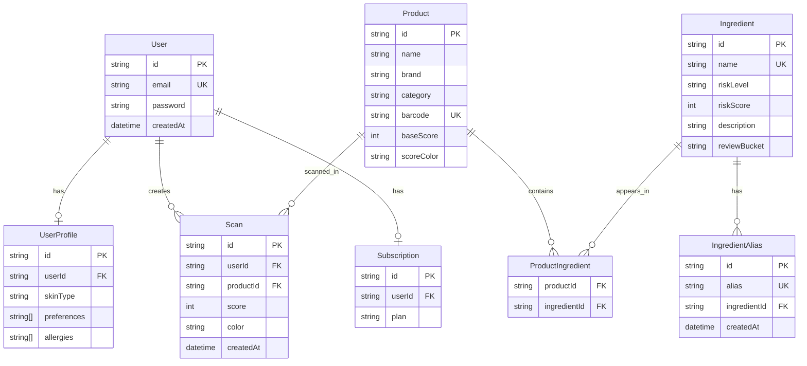
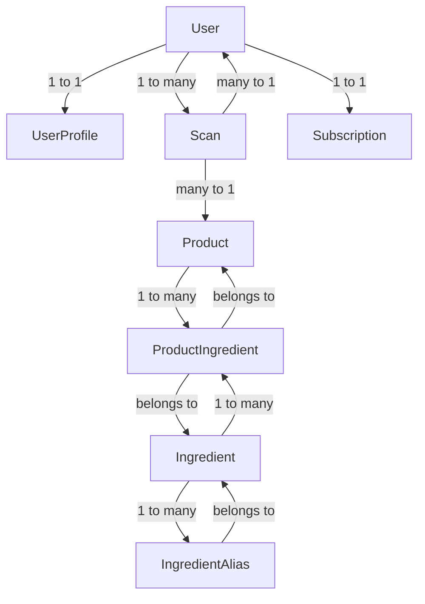

# Beauty Ingredient Scanner

A Next.js app that helps users scan or search beauty products, review ingredient risk, and compare products side by side.

## Stack

- Next.js 16
- React 19
- Prisma 7
- PostgreSQL
- NextAuth 5
- OpenAI API

## Required Environment Variables

Copy [`.env.example`](/Users/taylorpoe/Projects/Beauty_Ingreditent_Scanner/.env.example) to `.env.local` for local development and set the same values in Vercel:

- `DATABASE_URL`
- `AUTH_SECRET`
- `OPENAI_API_KEY`

## Local Development

```bash
npm install
npm run db:generate
npm run dev
```

## Database Commands

```bash
npm run db:migrate
npm run db:migrate:deploy
npm run db:seed
```

## Production Build

```bash
npm run build
npm run start
```

## Vercel Deployment

1. Import the repository into Vercel.
2. Set `DATABASE_URL`, `AUTH_SECRET`, and `OPENAI_API_KEY` in the Vercel project settings.
3. Use the default build command: `npm run build`.
4. If you are using Prisma migrations in production, run `npm run db:migrate:deploy` against the production database before or during deployment.

## Current Notes

- `/api` is a simple health check endpoint.
- `/api/scans` currently returns mock OCR output until a production OCR provider is wired in.
- Product detail pages now fetch data directly from Prisma instead of relying on a localhost-only API call.





